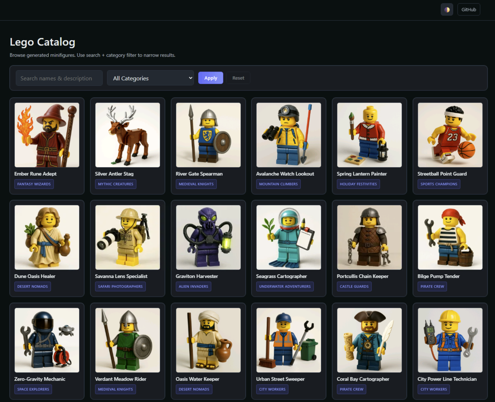

# MicroHack: Application Innovation
What is the next generation of modernization and why does it matter?

## MicroHack Context
We will work with simple Web applications built on .NET and SQL Server.



The application is deployed in a way that does not fully leverage the cloud: it cannot auto-scale or scale to zero, high availability is limited in its current form, and the deployment process is manual and error‑prone.

Note: All data in this application has been AI-generated and is for testing purposes only. We generated an initial batch for you, but if you're interested in generating your own, see [dataGenerator](/dataGenerator/README.md).

## MicroHack Objectives
- Learn how to take application from VM and deploy it using modern platform services using containers in **Azure Container Apps** and **Azure SQL Database**
- Investigate **auto-scaling** capabilities for application and databases including **scale-to-zero**
- Learn how to use Azure for **testing performance and functionality** of applications
- Automatically deploy changes using **CI/CD pipelines** and introduce staging environment and approval workflow in **GitHub Actions**
- Learn how to enable modern application monitoring and tracing using standard **OpenTelemetry**
- Optionally implement strict **security controls** and compliance measures
- Optionally enhance application with **AI capabilities**
- Learn to effectively use **GitHub Copilot** for brainstorming, analysis, writing scripts and Infrastructure as Code templates

## MicroHack Challenges
Focus on implementing **at least the first two challenges today** as a minimum out of the four major challenges. 

Challenge 5 is designed for participants who have time to spare or as follow‑up work after the MicroHack and comes in two optional flavors. The Enterprise flavor enhances enterprise‑grade security; the Innovation flavor adds AI capabilities to the application.

## MicroHack tips
- Use **GitHub Copilot** to help you author infrastructure (Bicep/Terraform), Dockerfiles, GitHub Actions workflows, scripts, and application code faster and with fewer errors. If you do not have a Business/Enterprise/Pro license, ask a facilitator to enable it.
- Take advantage of the **Azure MCP Server** in VS Code with GitHub Copilot to ask questions about Azure documentation, configurations, and services deployed in your environment. It can help you configure your database, Container Apps, or monitoring.
- Don't hesitate to **ask for help** from your peers or mentors if you get stuck.
- There are many ways to achieve the challenges; generally we recommend going **step-by-step**, leveraging Copilot, testing along the way, and using **repeatable patterns** (e.g., Infrastructure as Code).
- The lab environment includes a Virtual Machine (accessed via the Azure Portal) that can be used as a **development workstation** and has been tested for all challenges. You can also use your own device or GitHub Codespaces.
- Some **components include their own README.md file** in their respective folders. These help you understand how to run the application and which environment variables are supported.
- All challenges except for ch05-innovation are designed so that **you do not have to change any application code to succeed**. Making code changes is still fine if required for your chosen approach.

### Prerequisites and existing infrastructure
You must have GitHub account so you can ask for GitHub Copilot license for our session and get assigned to GitHub Organization (so you can leverage Codespaces and Actions paid centrally).

There is Azure subscription and Resource Group deployed for you and facilitator will provide you with login to [Azure Portal](https://portal.azure.com). Note due to security rules in training tenant you will be required to enroll this account to MFA using Microsoft Authenticator app after first login. Inside you will find Virtual Machine with credentials ```azureuser``` and password ```Azure12345678``` accessible via Bastion host from Azure Portal. This VM contains application that use local SQL Server Express, .NET app and image files stored in a folder.

After VM starts use PowerShell script ```C:\start-app.ps1``` to run your application and access it at ```http://localhost:5000```.

You can also use this VM as your developer station, there are tools preinstalled for you such as Docker environment, Azure CLI, SQL Server Management Studio, git and Visual Studio Code. You may also use your local computer or GitHub Codespaces for this MicroHack if you prefer.

Source code and important documentation for this application is stored in ```dotnet``` folder of this repository. In order to automate CI/CD later in a lab we suggest to clone this repo into your development environment.

### Facilitator instructions (students skip this)
- Make sure you have access to subscription and Entra ID role with permissions to create users (in MngEnv type of tenant you must use PIM to elevate to Global Admin in Entra). 
- Modify `config.auto.tfvars` with your Entra domain and set `n`, number of user environments.
- Deploy Terraform from [baseInfra](./baseInfra/README.md) (for large setup such as 50 or more seats, use -parallelism=40 to speed things up)
- After deployment there are Dev tools installation scripts running in VMs so you might wait few more minutes for this to finish.
- You may provision GitHub Organization for participants to give them Copilot licenses and environment for challenge 03. Follow [guide](./baseInfra/github/README.md)
- Default subscription limits in MngEnv type of subscriptions is good for 50 seats per region (50 ACA envs, 100 VM cores, 50 Grafana, ...). To scale for more configure Terraform with more regions (script will balance deployments to those - in Europe for example ["swedencentral", "germanywestcentral", "francecentral", "norwayeast"] ) or use more subscriptions (you will have to create separate deployments for this, script do not support multiple subscriptions natively).

### ch01: Migrate database, containerize application, deploy to Azure
[Challenge](/challenges/ch01/README.md) | [Solution]( /solutions/ch01/README.md)

### ch02: Test autoscaling under load
[Challenge](/challenges/ch02/README.md) | [Solution]( /solutions/ch02/README.md)

### ch03: Implement CI/CD pipeline to automatically deploy changes
[Challenge](/challenges/ch03/README.md) | [Solution]( /solutions/ch03/README.md)

### ch04: Monitor application performance with tracing
[Challenge](/challenges/ch04/README.md) | [Solution]( /solutions/ch04/README.md)

### ch05-enterprise: Implement security best practices
[Challenge](/challenges/ch05-enterprise/README.md) – Optional hardening: VNet integration, Private Endpoints, WAF (Front Door) as sole public entry, Entra ID auth, Managed Identity, CMK-backed data encryption, policy & logging.

### ch05-innovation: Implement AI capabilities
[Challenge](/challenges/ch05-innovation/README.md) – Optional AI enhancements: semantic search, grounding + recommendation chatbot, translations, image generation, personalization, or new AI microservices.